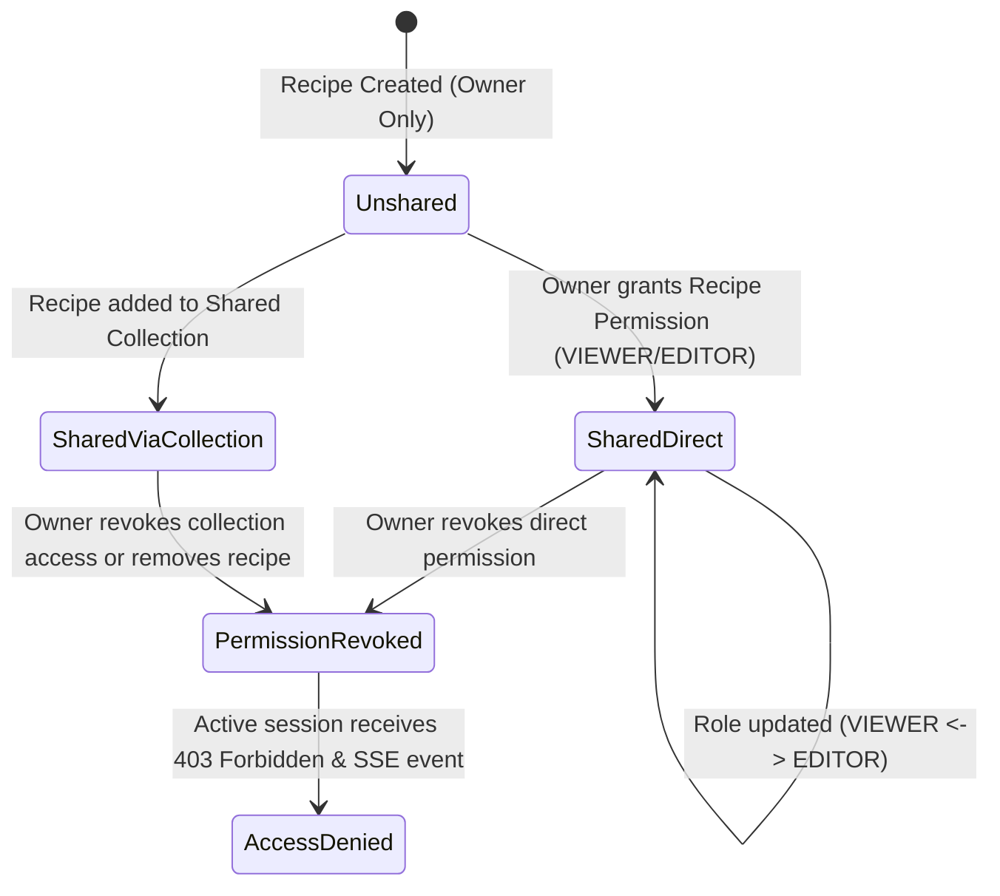
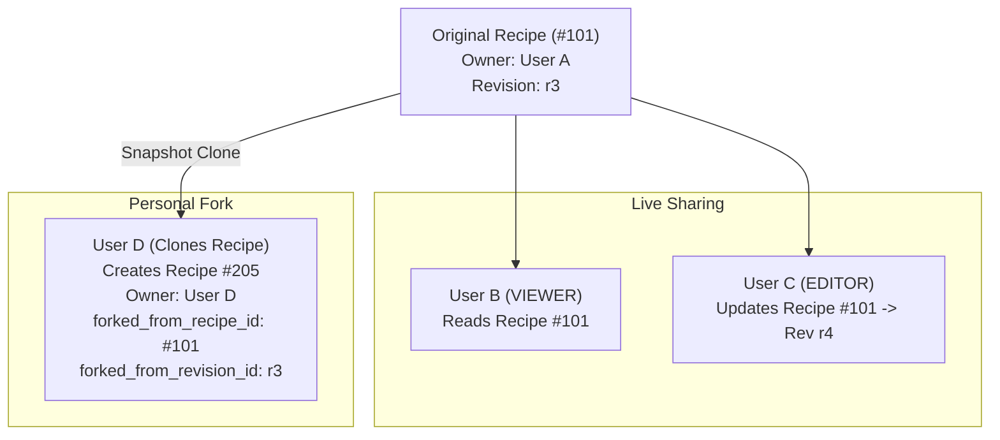

# Recipe Sharing, Cloning Semantics, Revision Lineage, and Revocation Architecture

**Document Status:** Complete / Architectural Research  
**Target Issue:** Issue #11 (Child of Map #1)  
**Domain Alignment:** Matches `CONTEXT.md` & `docs/research/drizzle-schema-taxonomy.md`  

---

## 1. Executive Summary

This document defines the complete data ownership model, permission state machine, fork/cloning copy semantics, revision lineage tracking, and real-time session revocation/update banners for the Vibecipes web platform (Issue #11).

### Key Architectural Decisions

1. **Explicit Data Ownership**: Every recipe has a single primary owner (`recipes.owner_id`). Access for non-owners is granted via explicit permission records (`recipe_permissions` and `collection_permissions`).
2. **Permissions State Machine**: Two operational shared roles are supported: `VIEWER` (read-only) and `EDITOR` (read/write steps and ingredients; ownership reassignment prohibited). Access can be revoked instantly at any time by the owner.
3. **Immutable Personal Forks (Copy Semantics)**:
   - **Shared Viewing/Editing**: Acts directly on the owner's canonical recipe record.
   - **Forking/Cloning**: Creates an independent, fully detached recipe owned by the target user. Forking captures an **immutable snapshot** of the recipe at that exact revision (`forked_from_recipe_id`, `forked_from_revision_id`).
   - **Revocation Immunity**: Once a user forks a recipe, subsequent access revocation by the original owner **does not** impact or delete the user's personal fork.
4. **Snapshot-Based Revision Lineage**: Every write operation (`UPDATE`, `DELETE`) creates an immutable record in `recipe_revisions` containing a complete JSON snapshot of the recipe graph (steps, step-ingredients, dietary traits). This enables linear revision histories, structural diffing, and zero-data-loss rollbacks.
5. **Real-time Active Session Banners**:
   - Uses Server-Sent Events (SSE) at `/api/recipes/:id/live-events` for active sessions (especially in Cook Mode or active editing).
   - **Access Revocation**: Displays a high-priority banner (`ACCESS_REVOKED`), disables edit controls, blocks further API mutations with HTTP `403 Forbidden`, and provides an option to prompt saving a local snapshot as a personal fork before navigation.
   - **Upstream Revision Update**: Displays a non-intrusive notification banner (`RECIPE_UPDATED`) alerting active sessions of newer revisions without breaking active cooking session timers or layout.

---

## 2. Data Ownership & Permissions State Machine

### 2.1 Permission Hierarchy & Roles

Access permissions follow a strict priority evaluation:
`OWNER` > `EDITOR` > `VIEWER` > `NONE`.

| Role | Read Recipe & Steps | Export / Fork Recipe | Edit Recipe & Steps | Add Revisions | Change Permissions | Delete Recipe |
| :--- | :---: | :---: | :---: | :---: | :---: | :---: |
| **`OWNER`** | ✅ | ✅ | ✅ | ✅ | ✅ | ✅ |
| **`EDITOR`** | ✅ | ✅ | ✅ | ✅ | ❌ | ❌ |
| **`VIEWER`** | ✅ | ✅ | ❌ | ❌ | ❌ | ❌ |
| **`NONE`** | ❌ | ❌ | ❌ | ❌ | ❌ | ❌ |

### 2.2 Permission Scopes

Permissions can be granted at three scopes:
1. **Direct Recipe Permission** (`recipe_permissions`): Grants access to a specific `recipe_id`.
2. **Collection Permission** (`collection_permissions`): Grants access to all recipes within a specified `collection_id` (including dynamic child recipes).
3. **Global Share** (`user_shares`): User-to-user blanket sharing (`SHARE_ALL_VIEW`, `SHARE_ALL_EDIT`).



---

## 3. Forking & Cloning Copy Semantics

### 3.1 Detached Personal Copy vs. Live Sharing

Vibecipes explicitly separates **live collaborative access** from **personal copy (forking)**:

- **Live Shared Access**: Multiple users (`VIEWER` or `EDITOR`) operate on the *same* underlying `recipes` record. Changes made by an `EDITOR` mutate the primary recipe and create a new revision visible to all authorized users.
- **Detached Forking**: Creates a brand new `recipes` row owned by the user performing the fork. 



### 3.2 Revocation Semantics & Fork Immunity

1. **Pre-Revocation Forking**: If User D forks Recipe #101 while having `VIEWER` access, Recipe #205 is an independent entity in SQLite. If User A later revokes User D's access to Recipe #101:
   - User D loses access to Recipe #101 (`403 Forbidden`).
   - User D **retains full ownership and control** of Recipe #205.
2. **Lineage Preservation**: The fork retains metadata pointers (`forked_from_recipe_id = 101`, `forked_from_revision_id = 'r3'`). If Recipe #101 is deleted or access is revoked, query logic uses `LEFT JOIN` or handles `NULL` parent references gracefully without corrupting the fork.

---

## 4. Revision Lineage Tracking & Diffing Boundaries

### 4.1 Revision Storage Strategy

To avoid complex multi-table cascade queries during revision history lookups, Vibecipes utilizes a **JSON Snapshot Architecture**:
- Each mutation saves a new row in `recipe_revisions`.
- `snapshot_data` stores the complete, normalized representation of the recipe at that timestamp, including all step orders, ingredient quantities, and canonical unit associations.

### 4.2 Revision Lineage Data Model

```
Recipe #101 (Current state in `recipes`, `recipe_steps`, `recipe_step_ingredients`)
  │
  ├── Revision 1 (Init creation by User A)
  ├── Revision 2 (Ingredient quantity adjustment by User A)
  └── Revision 3 (Instruction step re-ordering by User C - EDITOR)
        └── [Fork Point] -> Recipe #205 (User D's personal copy, starting at Revision 1)
```

### 4.3 Structural Diffing Boundaries

When comparing `Revision N` and `Revision N+1`, the diff engine evaluates three boundary layers:

1. **Metadata Boundary**: Title, description, base servings count, dietary traits.
2. **Step Sequence Boundary**: Step addition, deletion, re-ordering (`step_number` alignment).
3. **Step Ingredient Boundary**:
   - Matching ingredients by `canonical_ingredient_id`.
   - Quantity changes (scaled or absolute delta).
   - Unit changes (e.g. `200g` -> `250g` or `ml` -> `g`).
   - Preparation note modifications.

---

## 5. Active Session Notification & Revocation Banners

### 5.1 Real-Time Signal Protocol (SSE)

Active sessions (e.g. users viewing a recipe or running Cook Mode) subscribe to Server-Sent Events at:
`GET /api/recipes/:id/live-events`

#### Event Types Emitted by Hono Backend:

1. **`RECIPE_UPDATED`**: Emitted when an owner or editor publishes a new revision.
   ```json
   {
     "type": "RECIPE_UPDATED",
     "recipeId": 101,
     "revisionId": "rev_01HXYZ...",
     "updatedBy": "User C",
     "timestamp": "2026-08-30T12:00:00Z"
   }
   ```
2. **`ACCESS_REVOKED`**: Emitted when the logged-in user's permission to the recipe is revoked.
   ```json
   {
     "type": "ACCESS_REVOKED",
     "recipeId": 101,
     "reason": "Direct permission removed by owner",
     "timestamp": "2026-08-30T12:01:00Z"
   }
   ```

### 5.2 UI Banner Behavior Matrix

| Session State | Event Received | UI Banner Response | User Options |
| :--- | :--- | :--- | :--- |
| **Cooking Mode** | `RECIPE_UPDATED` | Subtle top warning banner: *"Recipe updated by owner."* Cooking timers and current steps remain uninterrupted. | `[View Differences]` `[Apply Updates]` `[Dismiss]` |
| **Editing Form** | `RECIPE_UPDATED` | Warning alert: *"Another user saved a new revision."* | `[Compare & Merge]` `[Overwrite as New Revision]` |
| **Any Active Page**| `ACCESS_REVOKED` | High-priority amber banner: *"Access to this recipe has been revoked."* Form inputs disabled immediately. | `[Save Local Fork]` `[Return to Recipes]` |

---

## 6. Drizzle ORM Database Schema Implementation

The following Drizzle SQLite schema models `recipe_permissions`, `collection_permissions`, `recipe_revisions`, and fork lineage columns on `recipes`:

```typescript
import { sqliteTable, text, integer, index, uniqueIndex } from 'drizzle-orm/sqlite-core';
import { sql } from 'drizzle-orm';
import { users } from './users';

// --- RECIPES TABLE WITH FORK LINEAGE ---
export const recipes = sqliteTable('recipes', {
  id: integer('id').primaryKey({ autoIncrement: true }),
  ownerId: text('owner_id').notNull().references(() => users.id, { onDelete: 'cascade' }),
  title: text('title').notNull(),
  description: text('description'),
  baseServings: integer('base_servings').notNull().default(4),
  dietaryTraits: text('dietary_traits').notNull().default('UNVERIFIED'), // VEGAN, VEGETARIAN, OMNIVORE
  
  // Fork Lineage Tracking
  forkedFromRecipeId: integer('forked_from_recipe_id'), // Self-reference (nullable)
  forkedFromRevisionId: text('forked_from_revision_id'), // Revision UUID at moment of fork
  
  createdAt: text('created_at').notNull().default(sql`(CURRENT_TIMESTAMP)`),
  updatedAt: text('updated_at').notNull().default(sql`(CURRENT_TIMESTAMP)`),
}, (table) => ({
  ownerIdx: index('recipes_owner_idx').on(table.ownerId),
  forkIdx: index('recipes_fork_idx').on(table.forkedFromRecipeId),
}));

// --- DIRECT RECIPE PERMISSIONS ---
export const recipePermissions = sqliteTable('recipe_permissions', {
  id: integer('id').primaryKey({ autoIncrement: true }),
  recipeId: integer('recipe_id').notNull().references(() => recipes.id, { onDelete: 'cascade' }),
  userId: text('user_id').notNull().references(() => users.id, { onDelete: 'cascade' }),
  role: text('role').notNull(), // 'VIEWER' | 'EDITOR'
  grantedAt: text('granted_at').notNull().default(sql`(CURRENT_TIMESTAMP)`),
}, (table) => ({
  recipeUserUnique: uniqueIndex('recipe_user_perm_unique').on(table.recipeId, table.userId),
  userPermIdx: index('recipe_perm_user_idx').on(table.userId),
}));

// --- COLLECTION PERMISSIONS ---
export const collections = sqliteTable('collections', {
  id: integer('id').primaryKey({ autoIncrement: true }),
  ownerId: text('owner_id').notNull().references(() => users.id, { onDelete: 'cascade' }),
  name: text('name').notNull(),
  createdAt: text('created_at').notNull().default(sql`(CURRENT_TIMESTAMP)`),
});

export const collectionPermissions = sqliteTable('collection_permissions', {
  id: integer('id').primaryKey({ autoIncrement: true }),
  collectionId: integer('collection_id').notNull().references(() => collections.id, { onDelete: 'cascade' }),
  userId: text('user_id').notNull().references(() => users.id, { onDelete: 'cascade' }),
  role: text('role').notNull(), // 'VIEWER' | 'EDITOR'
  grantedAt: text('granted_at').notNull().default(sql`(CURRENT_TIMESTAMP)`),
}, (table) => ({
  collUserUnique: uniqueIndex('coll_user_perm_unique').on(table.collectionId, table.userId),
}));

// --- RECIPE REVISIONS TABLE ---
export const recipeRevisions = sqliteTable('recipe_revisions', {
  id: text('id').primaryKey(), // UUID v4 or ULID
  recipeId: integer('recipe_id').notNull().references(() => recipes.id, { onDelete: 'cascade' }),
  revisionNumber: integer('revision_number').notNull(),
  createdById: text('created_by_id').notNull().references(() => users.id),
  changeSummary: text('change_summary'),
  
  // JSON Snapshot of complete recipe tree (steps, ingredients, units)
  snapshotData: text('snapshot_data').notNull(), 
  
  createdAt: text('created_at').notNull().default(sql`(CURRENT_TIMESTAMP)`),
}, (table) => ({
  recipeRevIdx: index('revisions_recipe_idx').on(table.recipeId, table.revisionNumber),
}));
```

---

## 7. Permission Resolution & Hono Middleware Implementation

### 7.1 Permission Resolution Function

```typescript
import { db } from '../db';
import { recipes, recipePermissions, collectionPermissions, collectionRecipes } from '../db/schema';
import { eq, and } from 'drizzle-orm';

export type UserRole = 'OWNER' | 'EDITOR' | 'VIEWER' | 'NONE';

export async function resolveUserRecipePermission(
  userId: string,
  recipeId: number
): Promise<UserRole> {
  // 1. Check Owner
  const recipe = await db.query.recipes.findFirst({
    where: eq(recipes.id, recipeId),
    columns: { ownerId: true }
  });

  if (!recipe) return 'NONE';
  if (recipe.ownerId === userId) return 'OWNER';

  // 2. Check Direct Recipe Permission
  const directPerm = await db.query.recipePermissions.findFirst({
    where: and(
      eq(recipePermissions.recipeId, recipeId),
      eq(recipePermissions.userId, userId)
    ),
  });

  if (directPerm) {
    return directPerm.role as UserRole;
  }

  // 3. Check Collection Permission (if recipe is inside a shared collection)
  const collectionMatch = await db
    .select({ role: collectionPermissions.role })
    .from(collectionRecipes)
    .innerJoin(
      collectionPermissions,
      eq(collectionRecipes.collectionId, collectionPermissions.collectionId)
    )
    .where(
      and(
        eq(collectionRecipes.recipeId, recipeId),
        eq(collectionPermissions.userId, userId)
      )
    )
    .limit(1);

  if (collectionMatch.length > 0) {
    return collectionMatch[0].role as UserRole;
  }

  return 'NONE';
}
```

### 7.2 Hono Middleware Endpoint Guard

```typescript
import { createMiddleware } from 'hono/factory';
import { resolveUserRecipePermission, UserRole } from '../services/permissions';

export const requireRecipeAccess = (minRole: 'VIEWER' | 'EDITOR' | 'OWNER') => {
  return createMiddleware(async (c, next) => {
    const user = c.get('user');
    const recipeId = parseInt(c.req.param('id'), 10);

    if (!user || isNaN(recipeId)) {
      return c.json({ error: 'Invalid request parameters or unauthenticated' }, 400);
    }

    const role = await resolveUserRecipePermission(user.id, recipeId);
    
    const roleWeights: Record<UserRole, number> = {
      'OWNER': 3,
      'EDITOR': 2,
      'VIEWER': 1,
      'NONE': 0
    };

    if (roleWeights[role] < roleWeights[minRole]) {
      return c.json({ 
        error: 'Forbidden: Insufficient recipe permissions',
        requiredRole: minRole,
        actualRole: role
      }, 403);
    }

    c.set('recipeRole', role);
    await next();
  });
};
```

---

## 8. Summary of Downstream Work & Next Steps

With this research completed:
1. **Drizzle ORM Schemas**: Permission and revision tables can be integrated directly into `src/db/schema/sharing.ts` during phase build.
2. **API Endpoint Security**: Hono routes for recipe updates/deletions will enforce `requireRecipeAccess('EDITOR')` and `requireRecipeAccess('OWNER')`.
3. **SSE Signal Service**: Event-driven notification system via SSE will connect frontend state management directly to active revision state and permission changes.
